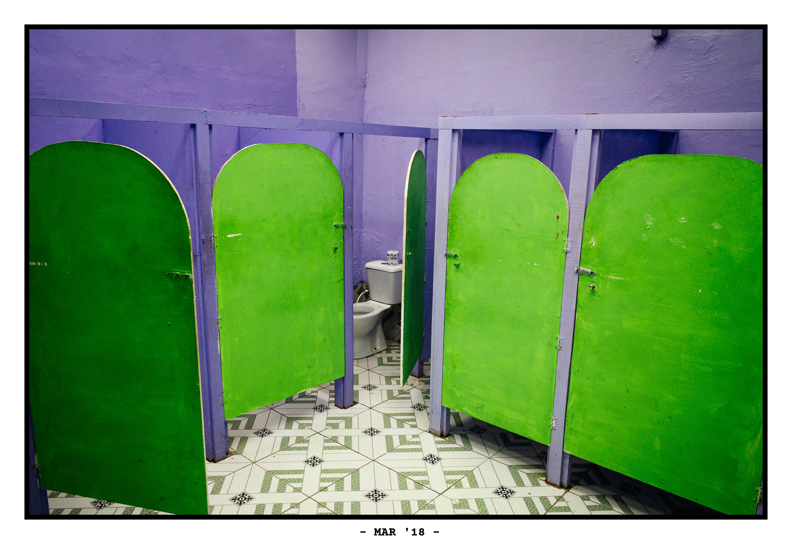
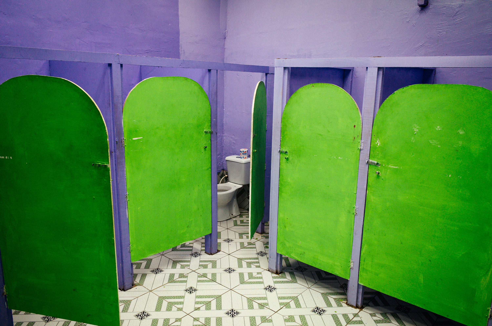
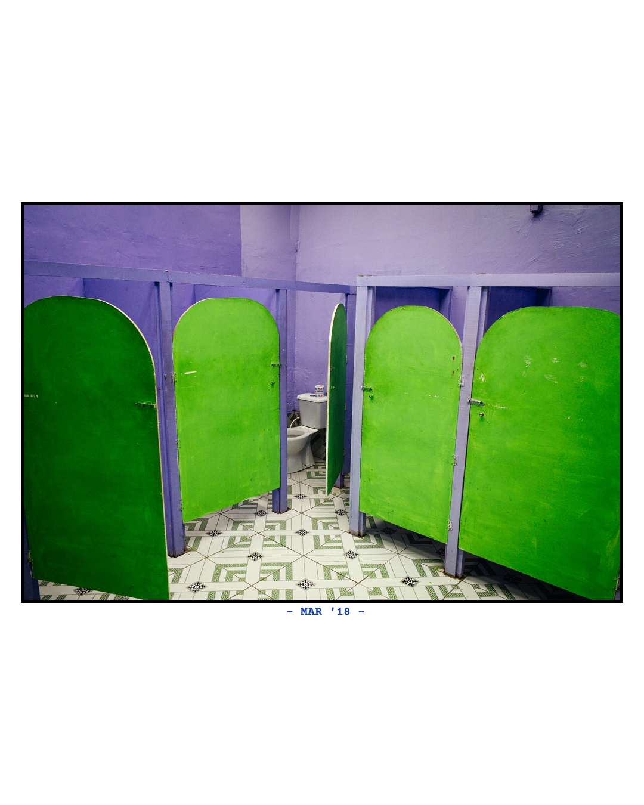

# Framer



This is a simple Go application that adds borders and captions to JPEG images. It is designed to be used as a post-processing step for images exported from Adobe Lightroom. This was an experiment in using LLM Models for the generation of personal tools and scripts. The entire code was created using [Claude Code](https://docs.anthropic.com/en/docs/agents-and-tools/claude-code/overview).

| Original               | Solid Border                                                                                                 | Instagram Frame                                                                                                                       |
| ---------------------- | ------------------------------------------------------------------------------------------------------------ | ------------------------------------------------------------------------------------------------------------------------------------- |
|  |                                                                                  |                                                                                                       |
| ––                     | Border Style: Solid / Padding: 100px | Border Style: Instagram / Internal Image Max. Size: 1000px / Font Color: #123abc |

## Inspiration

The inspiration for the border format comes from an old box of photos that I found from my grandfather. In the box, there were a number of photos that had a white border with a machine printed date.


## Features

- Two border styles:

  - `solid`: Clean, colored border with customizable padding
  - `instagram`: 4:5 ratio frame (1080x1350px) optimized for Instagram

- Caption features:

  - Automatic EXIF date extraction (displays as "MON 'YY")
  - Custom caption text support
  - Multiple embedded fonts
  - Customizable font size and color

- Border customization:
  - Percentage or pixel-based thickness
  - Color selection via hex values
  - Optional padding

## Installation

### From Source

1. Clone this repository:

   ```bash
   git clone https://github.com/yourusername/framer.git
   cd framer
   ```

2. Build the executable:

   ```bash
   go build framer.go fonts.go
   ```

3. Optional: Move the binary to your PATH for global access:
   ```bash
   sudo mv framer /usr/local/bin/
   ```

## Usage

```bash
# Process a single file with default settings
./framer -i /path/to/image.jpg -o /path/to/output_folder

# Process with custom border and font
./framer -i /path/to/image.jpg -o /path/to/output_folder -t 5% --font-size 50 --font-name "BigBlueTermPlusNerdFont-Regular" --border-color "#000000"

# Process a folder of images
./framer -i /path/to/folder -o /path/to/output_folder

# Instagram formatting with maximum size 900px
./framer -i /path/to/image.jpg -o /path/to/output_folder --border-style instagram --instagram-max-size 900

# List available embedded fonts
./framer --list-fonts
```

## Available Fonts

The following fonts are embedded into the binary:

- `CourierPrime-Bold` (default)
- `BigBlueTermPlusNerdFont-Regular`
- `HeavyDataNerdFont-Regular`

## Adding New Fonts

To add new fonts to the application:

1. Place your TTF or TTC font file in the `fonts_data/` directory
2. Update the `availableFonts` array in `framer.go` to include your font name (without extension)
3. Regenerate the embedded font data:
   ```bash
   go get -u github.com/go-bindata/go-bindata/...
   go install github.com/go-bindata/go-bindata/...
   $(go env GOPATH)/bin/go-bindata -pkg main -o fonts.go fonts_data/
   ```
4. Rebuild the application:
   ```bash
   go build framer.go fonts.go
   ```

## Command-line Arguments

- `--input`, `-i`: Path to a JPEG file or a folder containing JPEG files
- `--output`, `-o`: Output folder where processed images will be saved
- `--border-thickness`, `-t`: Border thickness in pixels or as a percentage (e.g. '10%')
- `--border-style`, `-s`: Border style: 'solid' or 'instagram'
- `--border-color`: Border color in hex (default: '#000000')
- `--caption`: Override the caption text (if empty, EXIF date is used)
- `--font-name`: Name of the font to use (run with --list-fonts to see available options)
- `--font-size`: Font size in pixels
- `--font-color`: Font color in hex (default: '#000000')
- `--instagram-max-size`: Maximum width/height for the image in Instagram style
- `--padding`: Additional padding around the image in pixels
- `--list-fonts`: List all available embedded fonts and exit

## Contributing

Contributions are welcome! Please feel free to submit a Pull Request.

## License

This project is licensed under the MIT License - see the LICENSE file for details.
